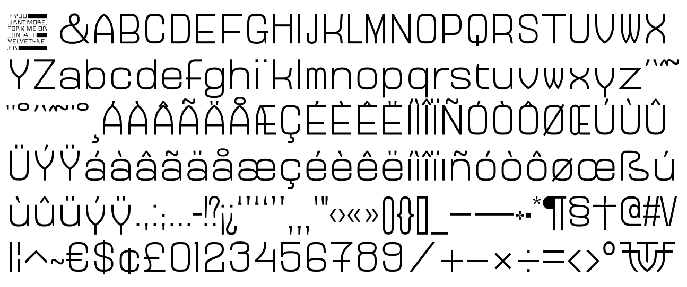

# VTF Standard Character Set

This is a minimum charset we now ask to publish a new typeface at [Velvetyne Type Foundry](http://velvetyne.fr). It includes basic latin + some more exotic shapes : a Velvetyne (VTF) monogram drawn in the style of your typeface and [a standard VTF .notdef](https://github.com/velvetyne/Velvetyne-Notdef). This charset should be adapted to each project.

## License

MIT
